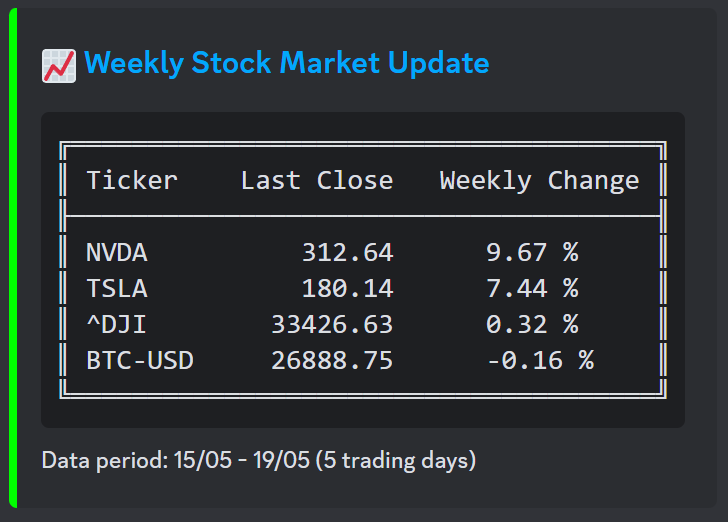

# stock-bot

Discord bot for monitoring the financial markets



## Features

-   Use `/stock-summary` command to get a weekly status on the stocks you follow (last 5 trading days)
-   Use `/stock-chart <ticker>` command to get the yearly chart for a stock

#### TODO:

This project is a work-in-progress. Here are some of the upcoming features:

-   [ ] Schedule stock summary updates at custom frequency
-   [ ] Look up information about individual stocks (e.g. price, market cap, earnings, etc.)
-   [ ] Alerts
    -   [ ] Price alerts: Get notified when a stock reaches a certain price
    -   [ ] Indicator alerts: Get notified when a stock reaches a certain value for a technical indicator (e.g. RSI, MACD, etc.)
    -   [ ] Events: Get notified when a high-impact event occurs (e.g. release of economic indicators, interest rates, earning reports for stocks you follow)
-   [ ] News
    -   [ ] Provide news related to the stocks you follow
    -   [ ] Sentiment analysis of news related to the stocks you follow
-   [ ] Virtual portfolio: Simulate trading and get a summary of your performance
-   [ ] Trading opportunities: Get notified before an indicator suggests a trading opportunity for a stock you follow

## Requirements

-   A [Discord app](https://discord.com/developers/docs/intro) with the following bot permissions:
    -   `Send Messages`
    -   `Use Slash Commands`
-   The [Poetry package manager](https://python-poetry.org/docs/#installation)

## Getting Started

**1. Clone the repository**

```bash
git clone https://github.com/holstt/stock-bot.git
cd stock-bot
```

**2. Create a config file**

`example.config.yml` can be used as a template for the config file. Rename it to `config.yml` and fill in the required fields. If the config file is not placed in project root, the config path should be specified when running the bot (see step 4).

```yaml
# ./example.config.yml

# Your discord bot token
bot_token: "BOT_TOKEN"

# ID of the discord server where the bot should be used
target_guild: 1234567890

# Example tickers. Find ticker symbols at https://finance.yahoo.com/
tickers:
    - NVDA
    - TSLA
    - BTC-USD
    - ^DJI
```

### Local install

**3. Install dependencies**

```bash
# Use poetry to install dependencies and create a virtual environment
poetry install
poetry shell
```

**4. Run the bot**

```bash
# Run the bot
python ./main.py

# Run the bot using a custom config file path
python ./main.py --config /path/to/config
```

### Docker

A docker-compose template can be found in `./docker/docker-compose.yml`. Ensure the volume paths are correct before running the bot.

```bash
cd docker
docker compose up -d
```
